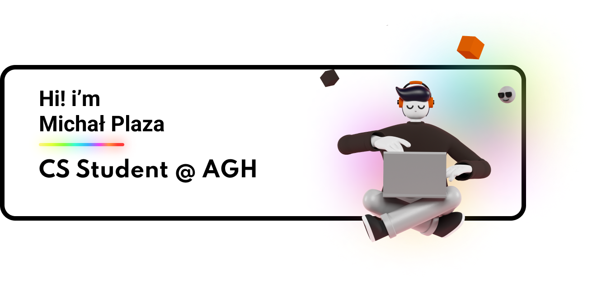

🎓 I'm a 3rd-year Computer Science student at AGH University of Science and Technology in Kraków, Poland.

🚀 Passionate about exploring the vast landscape of computing! My interests range from building efficient **Backend Systems** and exploring **AI/Machine Learning** advancements to diving into **Low-Level Programming** with C++, understanding hardware interactions, and even dabbling in **Computer Graphics** and **Game Development** concepts. I'm fascinated by the 'why' and 'how' behind technology, including theoretical CS.

🌱 **Currently Learning & Exploring:**
*   Modern Backend Frameworks: Focusing on **FastAPI** 🐍
*   High-Performance Languages: Learning **Go** and **Rust** 🦀
*   Deepening my **Machine Learning** knowledge (via Coursera & personal projects)
*   Continuously improving my **C++** skills for systems and graphics work.

💼 **Experience:**
*   Co-founded **Venti Labs**, leading development and delivering a Python/Django application for the renewable energy sector.

🔭 **Seeking:**
*   Challenging **Software Engineering / Backend / ML Internship** opportunities where I can learn, contribute, and grow.

📫 **Connect with me:**
*   [LinkedIn](https://www.linkedin.com/in/michal-plaza/)

<!-- Optional: Add GitHub Stats, Top Languages, etc. -->
